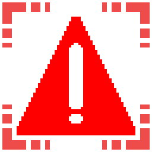

# TERMINAL THAT CAN KILL

 

**Language / Язык:** [English](#english) · [Русский](#russian)

## TERMINAL THAT CAN KILL

**Author:** Solo00n

The ship and facility doors slam shut on anyone in the doorway, and the terminal stops disabling traps — it detonates mines and drives turrets berserk instead.

### WHAT IT DOES

- <strong style="color: #cc0000;">Deadly ship door</strong> — the hangar door crushes any player or monster standing in the opening when it closes (on the surface only).
- <strong style="color: #cc0000;">Deadly facility doors</strong> — the big terminal-code security doors crush whoever is in the opening when they slam shut.
- <strong style="color: #cc0000;">Remote mine detonation</strong> — entering a mine code blows it up instead of disabling it; a critical error chain-detonates nearby mines.
- <strong style="color: #cc0000;">Turret rampage</strong> — entering a turret code sends it berserk (spins and fires at everyone); a critical error extends the rampage.
- <strong style="color: #cc0000;">Turret head flip</strong> — after leaving berserk a turret smoothly turns its head 180° and rests facing the opposite way.
- <strong style="color: #cc0000;">Barber-style death</strong> — door kills reuse the Barber (Clay Surgeon) death: the body is launched up and ragdolls.
- <strong style="color: #cc0000;">Fully configurable</strong> — every mechanic can be tuned or turned off.

### HOW IT WORKS

- The kill zone is a thin oriented slab sitting <strong style="color: #cc0000;">in the doorway plane</strong>, not a proximity sphere — only someone standing in the opening is caught.
- Ship door: detected via <code>doorPower &lt; 1</code> plus the <code>ShipDoorClose</code> animator state; the doorway is at a fixed world position (the ship never moves).
- Facility doors: detected on the <code>SetDoorOpen</code> open→closed transition and processed frame by frame.
- Traps use the vanilla synced RPCs (<code>ExplodeMineServerRpc</code>, <code>EnterBerserkModeServerRpc</code>) — no custom network objects.

### MULTIPLAYER (HOST-AUTHORITATIVE)

<blockquote style="border-left: 4px solid #cc0000; padding-left: 15px;">
Both the <strong style="color: #cc0000;">host and all clients must install the mod.</strong> It changes shared game rules, not one player's private state.
  
<strong style="color: #cc0000;">Players:</strong> each client only kills its own local player; <code>KillPlayer</code> syncs that death to everyone, so exactly one authoritative kill happens. 
<strong style="color: #cc0000;">Monsters:</strong> only the host iterates and kills enemies (the host owns enemy AI), which syncs to clients. 
<strong style="color: #cc0000;">Traps:</strong> mine and turret effects fire through the game's own server RPCs, so all clients see the same result.
</blockquote>

### REQUIREMENTS

- <strong style="color: #cc0000;">BepInEx</strong> 5.4.21+ (<code>BepInEx-BepInExPack-5.4.2100</code>)
- Lethal Company <strong style="color: #cc0000;">V81</strong>

### INSTALLATION

- <strong style="color: #cc0000;">Mod manager</strong> (r2modman / Thunderstore Mod Manager): search for the mod and click Install.
- <strong style="color: #cc0000;">Manual:</strong> install the BepInEx pack, then drop <code>Solon.TerminalThatCanKill.dll</code> into <code>BepInEx/plugins/</code>.

### CONFIGURATION

File: <code>BepInEx/config/Solon.TerminalThatCanKill.cfg</code> (created on first launch).

<table border="1" style="border-collapse: collapse; border: 1px solid #cc0000;">
<tr style="background: #1a1a1a;">
<th style="color: #cc0000;">Key</th><th style="color: #cc0000;">Default</th><th style="color: #cc0000;">Description</th>
</tr>
<tr><td><code>Enabled</code></td><td><code>true</code></td><td>Master switch for the deadly-doors mechanic.</td></tr>
<tr><td><code>KillPlayers</code></td><td><code>true</code></td><td>Kill players caught in a closing doorway.</td></tr>
<tr><td><code>KillMonsters</code></td><td><code>false</code></td><td>Kill ship-capable monsters caught in a closing doorway.</td></tr>
<tr><td><code>AffectedDoors</code></td><td><code>Both</code></td><td><code>ShipDoor</code> / <code>TerminalDoors</code> / <code>Both</code>.</td></tr>
<tr><td><code>SafeZoneSeconds</code></td><td><code>5</code></td><td>Grace period after landing during which doors do not kill.</td></tr>
<tr><td><code>DamageMode</code></td><td><code>InstantKill</code></td><td><code>InstantKill</code> or <code>DamageOverTime</code>.</td></tr>
<tr><td><code>EnableRemoteControl</code></td><td><code>true</code></td><td>Detonate/rampage traps instead of disabling them.</td></tr>
<tr><td><code>MineErrorChance</code></td><td><code>0.15</code></td><td>Chance a mine command misfires into a chain blast.</td></tr>
<tr><td><code>TurretErrorChance</code></td><td><code>0.15</code></td><td>Chance a turret command misfires into a sustained rampage.</td></tr>
<tr><td><code>TurretFlipOnBerserkExit</code></td><td><code>true</code></td><td>Turret head turns 180° after leaving berserk.</td></tr>
</table>

<blockquote style="border-left: 4px solid #cc0000; padding-left: 15px;">
Advanced tuning (zone size <code>DoorwayThickness/Width/Height</code>, close timings, <code>PlayerDeathAnimationId</code>, chain radius, rampage duration) lives in the <code>Doors.Advanced</code> and <code>RemoteControl.Advanced</code> sections of the config.
</blockquote>

### COMPATIBILITY

- Works on vanilla and modded moons (<strong style="color: #cc0000;">LethalLevelLoader</strong>) — doors are found dynamically, no hard-coded scenes.
- No custom network objects; relies on vanilla RPCs — low conflict risk with other terminal mods.
- If another mod also patches the terminal code function, set <code>EnableRemoteControl = false</code> to avoid overlap.

### BUILD

<pre style="border: 1px solid #cc0000; padding: 10px;">dotnet build LethalDoors.csproj -c Release</pre>

Output: <code>bin/Release/Solon.TerminalThatCanKill.dll</code>. Game assemblies are referenced via the <code>LethalCompany.GameLibs.Steam</code> NuGet package as compile-only (<code>PrivateAssets="all"</code>) — no game files are distributed.

### CREDITS

- <strong style="color: #cc0000;">Solo00n</strong> — author.
- Built on <strong style="color: #cc0000;">BepInEx</strong> and <strong style="color: #cc0000;">HarmonyX</strong>.
- Inspiration: <em>Lethal Doors</em> by saint_kendrick (ship-door approach) and <em>RemoteMineDetonation</em> by jacksonb-cs (terminal detonation idea).
- Licensed under <strong style="color: #cc0000;">MIT</strong>.

## TERMINAL THAT CAN KILL

**Автор:** Solo00n

Двери корабля и комплекса захлопываются насмерть на том, кто стоит в проёме, а терминал больше не отключает ловушки — вместо этого он детонирует мины и сводит турели с ума.

### ЧТО ДЕЛАЕТ МОД

- <strong style="color: #cc0000;">Смертельная дверь корабля</strong> — рампа раздавливает игрока или монстра в проёме при закрытии (только на поверхности).
- <strong style="color: #cc0000;">Смертельные двери комплекса</strong> — большие двери с кодом раздавливают того, кто стоит в проёме при захлопывании.
- <strong style="color: #cc0000;">Удалённая детонация мин</strong> — ввод кода мины взрывает её вместо отключения; при критической ошибке детонируют соседние мины.
- <strong style="color: #cc0000;">Бешенство турели</strong> — ввод кода турели вводит её в берсерк (крутится и стреляет по всем); ошибка продлевает раж.
- <strong style="color: #cc0000;">Разворот головы турели</strong> — после берсерка турель плавно поворачивает голову на 180° и остаётся смотреть в другую сторону.
- <strong style="color: #cc0000;">Смерть как у Barber</strong> — смерть от двери повторяет смерть от Barber (Clay Surgeon): тело подбрасывает вверх.
- <strong style="color: #cc0000;">Полная настройка</strong> — любую механику можно подстроить или выключить.

### КАК ЭТО РАБОТАЕТ

- Зона поражения — тонкая ориентированная «плита» <strong style="color: #cc0000;">в плоскости проёма</strong>, а не сфера: убивает только того, кто стоит в проёме.
- Дверь корабля: определяется по <code>doorPower &lt; 1</code> плюс состоянию аниматора <code>ShipDoorClose</code>; проём в фиксированной точке мира (корабль не двигается).
- Двери комплекса: ловятся на переходе <code>SetDoorOpen</code> открыта→закрыта и обрабатываются покадрово.
- Ловушки используют ванильные синхронизированные RPC (<code>ExplodeMineServerRpc</code>, <code>EnterBerserkModeServerRpc</code>) — без своих сетевых объектов.

### МУЛЬТИПЛЕЕР (HOST-AUTHORITATIVE)

<blockquote style="border-left: 4px solid #cc0000; padding-left: 15px;">
Мод должен стоять <strong style="color: #cc0000;">и у хоста, и у всех клиентов.</strong> Он меняет общие правила игры, а не приватное состояние одного игрока.
  
<strong style="color: #cc0000;">Игроки:</strong> каждый клиент убивает только своего локального игрока; <code>KillPlayer</code> синхронизирует смерть на всех — ровно одно авторитетное убийство. 
<strong style="color: #cc0000;">Монстры:</strong> перебирает и убивает врагов только хост (владеет ИИ), что синхронизируется клиентам. 
<strong style="color: #cc0000;">Ловушки:</strong> эффекты мин и турелей идут через серверные RPC самой игры, поэтому итог одинаков у всех.
</blockquote>

### ЗАВИСИМОСТИ

- <strong style="color: #cc0000;">BepInEx</strong> 5.4.21+ (<code>BepInEx-BepInExPack-5.4.2100</code>)
- Lethal Company <strong style="color: #cc0000;">V81</strong>

### УСТАНОВКА

- <strong style="color: #cc0000;">Через менеджер</strong> (r2modman / Thunderstore Mod Manager): найти мод и нажать Install.
- <strong style="color: #cc0000;">Вручную:</strong> установить BepInEx-пак, затем положить <code>Solon.TerminalThatCanKill.dll</code> в <code>BepInEx/plugins/</code>.

### НАСТРОЙКА

Файл: <code>BepInEx/config/Solon.TerminalThatCanKill.cfg</code> (создаётся при первом запуске).

<table border="1" style="border-collapse: collapse; border: 1px solid #cc0000;">
<tr style="background: #1a1a1a;">
<th style="color: #cc0000;">Ключ</th><th style="color: #cc0000;">По умолчанию</th><th style="color: #cc0000;">Описание</th>
</tr>
<tr><td><code>Enabled</code></td><td><code>true</code></td><td>Главный выключатель механики смертельных дверей.</td></tr>
<tr><td><code>KillPlayers</code></td><td><code>true</code></td><td>Убивать игроков в закрывающемся проёме.</td></tr>
<tr><td><code>KillMonsters</code></td><td><code>false</code></td><td>Убивать монстров (способных войти в корабль) в проёме.</td></tr>
<tr><td><code>AffectedDoors</code></td><td><code>Both</code></td><td><code>ShipDoor</code> / <code>TerminalDoors</code> / <code>Both</code>.</td></tr>
<tr><td><code>SafeZoneSeconds</code></td><td><code>5</code></td><td>Безопасный период после посадки, пока двери не убивают.</td></tr>
<tr><td><code>DamageMode</code></td><td><code>InstantKill</code></td><td><code>InstantKill</code> или <code>DamageOverTime</code>.</td></tr>
<tr><td><code>EnableRemoteControl</code></td><td><code>true</code></td><td>Детонация/раж ловушек вместо отключения.</td></tr>
<tr><td><code>MineErrorChance</code></td><td><code>0.15</code></td><td>Шанс сбоя команды мины (цепной взрыв).</td></tr>
<tr><td><code>TurretErrorChance</code></td><td><code>0.15</code></td><td>Шанс сбоя команды турели (продлённый раж).</td></tr>
<tr><td><code>TurretFlipOnBerserkExit</code></td><td><code>true</code></td><td>Разворот головы турели на 180° после берсерка.</td></tr>
</table>

<blockquote style="border-left: 4px solid #cc0000; padding-left: 15px;">
Тонкая настройка (размеры зоны <code>DoorwayThickness/Width/Height</code>, тайминги закрытия, <code>PlayerDeathAnimationId</code>, радиус цепи, длительность ража) — в разделах <code>Doors.Advanced</code> и <code>RemoteControl.Advanced</code> конфига.
</blockquote>

### СОВМЕСТИМОСТЬ

- Работает на ванильных и модовых лунах (<strong style="color: #cc0000;">LethalLevelLoader</strong>) — двери находятся динамически, без хардкода сцен.
- Не создаёт своих сетевых объектов, опирается на ванильные RPC — низкий риск конфликтов.
- Если другой мод тоже патчит функцию кода терминала — поставьте <code>EnableRemoteControl = false</code>.

### СБОРКА

<pre style="border: 1px solid #cc0000; padding: 10px;">dotnet build LethalDoors.csproj -c Release</pre>

Результат: <code>bin/Release/Solon.TerminalThatCanKill.dll</code>. Сборки игры подключены через NuGet-пакет <code>LethalCompany.GameLibs.Steam</code> только для компиляции (<code>PrivateAssets="all"</code>) — файлы игры не распространяются.

### БЛАГОДАРНОСТИ

- <strong style="color: #cc0000;">Solo00n</strong> — автор.
- Построено на <strong style="color: #cc0000;">BepInEx</strong> и <strong style="color: #cc0000;">HarmonyX</strong>.
- Идеи: <em>Lethal Doors</em> от saint_kendrick (подход к двери корабля) и <em>RemoteMineDetonation</em> от jacksonb-cs (детонация из терминала).
- Лицензия <strong style="color: #cc0000;">MIT</strong>.
